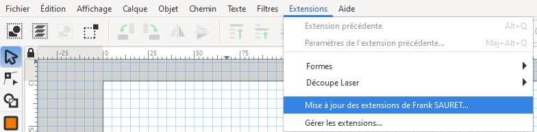

# Description
Ensemble inkScape contenant un tuto., des extensions, palettes et templates, principalement à destination de la découpe avec la Speedy 100 de trotec.
# Installation 
Télécharger le zip (dans « Releases > latest » à droite de cette page).
1.	Si vous n’avez jamais lancé Inkscape sur votre session, faites-le puis refermez-le.
2.	Copiez le contenu du dossier inkscape fourni, dans le dossier utilisateur d’inkscape « C:\Users\Nom utilisateur\AppData\Roaming\inkscape » autorisez le replacement des fichiers. **IMPORTANT : Inkscape doit avoir été lancé au moins une fois** ( on peut atteindre le dossier « C:\Users\Nom utilisateur\AppData\Roaming  » en tapant « **%appdata%** » dans la barre de l’explorateur).
3.	Lancez inkscape puis vérifiez que la première case ci-dessous est bien décochée (dans édition >  préférences > Comportement > Transformations) :

# Mise à Jour
Désormais toutes mes extensions peuvent se mettre à jour toute seule.
L'option est tout en bas des extensions.

Le faire régulièrement, il ne prévient pas lors d'une mise à jour possible.
Redémarrer InkScape après cette mise à jour.